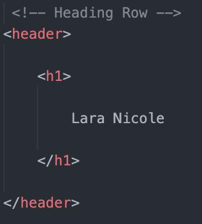

# My Portfolio Template
---

## Description

The aim of this project was to create a responsive web template for an individual to display a portfolio of work samples to a potential future employer. It was necessary that the layout of this webpage needed to follow accessibility standards as well. This webpage displays a clean and simplistic layout for one to display their portfolio samples, as well as information about themselves and a contact form. Due to creating this project from scratch, it allows one to practice basic as well as advanced HTML and CSS, such as flexboxes, media queries and CSS variables. As this is one of my first solo projects, creating a responsive web page came with a lot of bugs and issues which I tried to fix to the best of my ability. Hopefully, in future I will be able to master CSS flexboxes and pw font-size in order to create a smoother responsive webpage. 

## Table of Contents

- [Installation](#installation)
- [Usage](#usage)
- [Credits](#credits)

## Installation

Below is an example of how you can download the project onto your own device:

1. Open your devices terminal application
2. Locate to the correct file destination that you are wanting to download this project to
3. Clone the repository using this link:
    ```md
        git clone https://github.com/squrpe/bootcamp-week2challenge.git
    ```
4. You may get prompted to input you github details, thus do so. Otherwise, the project will now be succesfully installed onto your device.

## Usage

To access this project, you can download an IDE of your choice but we recommend Visual Studio Code.

After downloading the IDE of your choice you will have access to the raw code. However to host the webpage locally, you will need to download an extension that allows you to open it into your default browser or in your IDE. I recommend Liveserver:


Then using this type of extension, right clicking the file and pressing "Open with Live Server" allows you to open the webpage in your default browser.

If you wanted to replace your information with the example, follow the comments layed out in index.html that display each important section. Then look for the HTML elements that are spread out from the rest of the code for adjustment. For example:




## Credits

`Code Snippets:`

Contact Form HTML & CSS: https://www.w3schools.com/howto/howto_css_contact_form.asp

```
HTML:

<div class="container">
  <form action="action_page.php">

    <label for="fname">First Name</label>
    <input type="text" id="fname" name="firstname" placeholder="Your name..">

    <label for="lname">Last Name</label>
    <input type="text" id="lname" name="lastname" placeholder="Your last name..">

    <label for="country">Country</label>
    <select id="country" name="country">
      <option value="australia">Australia</option>
      <option value="canada">Canada</option>
      <option value="usa">USA</option>
    </select>

    <label for="subject">Subject</label>
    <textarea id="subject" name="subject" placeholder="Write something.." style="height:200px"></textarea>

    <input type="submit" value="Submit">

  </form>
</div>
```

```
CSS:

/* Style inputs with type="text", select elements and textareas */
input[type=text], select, textarea {
  width: 100%; /* Full width */
  padding: 12px; /* Some padding */ 
  border: 1px solid #ccc; /* Gray border */
  border-radius: 4px; /* Rounded borders */
  box-sizing: border-box; /* Make sure that padding and width stays in place */
  margin-top: 6px; /* Add a top margin */
  margin-bottom: 16px; /* Bottom margin */
  resize: vertical /* Allow the user to vertically resize the textarea (not horizontally) */
}

/* Style the submit button with a specific background color etc */
input[type=submit] {
  background-color: #04AA6D;
  color: white;
  padding: 12px 20px;
  border: none;
  border-radius: 4px;
  cursor: pointer;
}

/* When moving the mouse over the submit button, add a darker green color */
input[type=submit]:hover {
  background-color: #45a049;
}

/* Add a background color and some padding around the form */
.container {
  border-radius: 5px;
  background-color: #f2f2f2;
  padding: 20px;
}
```

Flexbox Image Gallery: https://www.w3schools.com/css/css3_flexbox_responsive.asp

```
HTML:

<!-- Header -->
<div class="header">
  <h1>Responsive Image Gallery</h1>
  <p>Resize the browser window to see the responsive effect.</p>
</div>

<!-- Photo Grid -->
<div class="row"> 
  <div class="column">
    
    
    
    
    
    
    
  </div>
  
  <div class="column">
    
    
    
    
    
    
  </div> 
   
  <div class="column">
    
    
    
    
    
    
    
  </div>
  
  <div class="column">
    
    
    
    
    
    
  </div>
</div>
```

```
CSS:

* {
  box-sizing: border-box;
}

body {
  margin: 0;
  font-family: Arial;
}

.header {
  text-align: center;
  padding: 32px;
}

.row {
  display: flex;
  flex-wrap: wrap;
  padding: 0 4px;
}

/* Create four equal columns that sits next to each other */
.column {
  flex: 25%;
  max-width: 25%;
  padding: 0 4px;
}

.column img {
  margin-top: 8px;
  vertical-align: middle;
}

/* Responsive layout - makes a two column-layout instead of four columns */
@media (max-width: 800px) {
  .column {
    flex: 50%;
    max-width: 50%;
  }
}

/* Responsive layout - makes the two columns stack on top of each other instead of next to each other */
@media (max-width: 600px) {
  .column {
    flex: 100%;
    max-width: 100%;
  }
}
```

`Images credit:`
- [sunset.jpeg](https://wallpaperaccess.com/black-and-white-beach)
- [eye.jpeg](https://www.pexels.com/photo/grayscale-close-up-photo-of-human-eye-3732993/)
- [rain.jpeg](https://www.alamy.com/stock-image-monochrome-photo-of-blurred-street-lights-and-tail-lamps-seen-through-163363178.html)
- [flower.jpeg](https://www.hdwallpapers.net/flowers/black-and-white-daisies-wallpaper-424.htm)
- [musician.webp](https://www.gettyimages.ca/detail/news-photo/bo-didley-performs-live-in-december-1970-in-san-francisco-news-photo/90963962?adppopup=true)

---

## Features

- Alternative Text for images
- Form labels
- Language: English

## Contact

Lara Grocke - [@my_twitter](twitter.com) - [myemail@email.com](gmail.com)

Project Link - https://github.com/squrpe/bootcamp-week2challenge